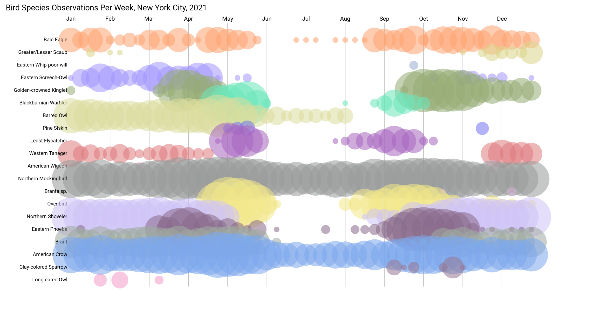

# Bird Vis 

Yesterday, we implemented the month labels for our bird visualization. Today, we'll focus on 3 things:
1) Randomly selecting species from our list of observations (`selectSpecies()`)
2) Actually drawing the circles for each week of species observations (inside `draw()`)
3) Randomly generating color palettes for each species (`generateColors()`)



To get your project looking like the one above, we'll need to learn some new functions:

## `random()`
One of the most important things you’ll need to do is randomly pick species or colors. The random() function is the key to this.

What it does: Generates a random number. You can specify a range of numbers, and it will return a number within that range.

Example:
random(10, 20) would give you a random number between 10 and 20.
random(255) gives you a random number between 0 and 255.
This will be useful for randomly selecting species or generating random colors.

## `includes()`
Sometimes, when you’re picking random items (like species), you don’t want to pick the same item twice. The includes() function checks if a specific item is already in an array.

What it does: Returns true if the item is in the array, and false if it’s not.

Example:
`selectedSpecies.includes(speciesName)` will check if the species is already in the `selectedSpecies` array.
This will help you ensure that each species you pick is unique.

## `color()`
Previously, when using functions like `background()` or `fill()` we passed 3 or 4 separate numbers. But what if we want to reuse the same color over and over? Instead of passing separate values, we can save a color as a variable using `color()`.

What it does: Creates a color based on red, green, and blue (RGB) values, along with an optional transparency value.

Example:
`let myRed = color(255, 0, 0)` creates a pure red color and saves it in the `myRed` variable.
`color(100, 150, 200, 150)` creates a semi-transparent color.
Each species will get a random color, so it’s important to understand how to generate these.

## `map()`
Data visualization is all about transforming numbers into visuals. Yesterday, we used `map()` to transform month counts into x-positions on the canvas. You'll be using `map()` today for that kind of operation, as well as mapping the amount of birds to the size of your circles.

What it does: Maps a number from one range to another. This is super helpful when you need to adjust the position of elements or their size based on some data.

Example:
`map(5, 0, 10, 0, 100)` will map the value 5 (from the range 0-10) to the range 0-100, so the result would be 50.
You’ll use `map()` to convert data, like bird counts, into positions or sizes on the screen.

## `max()`
When you’re working with different data values, you often need to know the highest value. The `max()` function will help you do that.

What it does: Returns the highest number from a set of values.

Example:
`max([10, 20, 30])` would return 30.
You can use this to find the highest bird count, which will help you scale your circles so that the largest counts are represented by the biggest circles.

## Concepts You'll Use
1. Iterating with Loops
To process each species and each of their observations, you’ll need to use loops.

What they do: Loops allow you to repeat actions for multiple items. You’ll be using loops to go through the species list and their observation data week by week.

A for loop is great for going through a list, like we did yesterday:

```
for (let i = 0; i < speciesList.length; i++) {
  // Do something for each species
}
```

2. Scaling Data with Logarithms
When the data you’re working with has large differences between the smallest and largest values (like bird counts), using logarithms can help scale them down to a more manageable size.


What it does: The `log()` function returns the logarithm of a number. This is useful for scaling large values so they’re visually easier to represent.
Example:
`log(10)` will return the logarithm of 10. This is a way to "compress" large numbers more than small numbers, so that the difference between them isn’t as extreme.

You’ll likely use this to scale the sizes of the circles so that the data is easier to read.

Putting It All Together
Here’s a quick recap of the functions and concepts you’ll need to complete your visualization:

Random Selection: Use `random()` to randomly choose species and generate colors. Make sure the species you choose are unique by using `includes()` to check if they’ve already been picked.

Mapping Data: Use `map()` to adjust the position and size of your elements on the canvas.

Tracking Maximum Values: Use `max()` to find the highest bird count across all species, which will help you scale the circles.

Logarithmic Scaling: Use `log()` to scale the bird count data so the circles don’t get too large.

With these tools, you’ll be able to complete the missing parts of your bird visualization! Keep experimenting with these functions, and don't be afraid to explore more on your own as you work through the assignment. We'll be around to answer any questions you have.